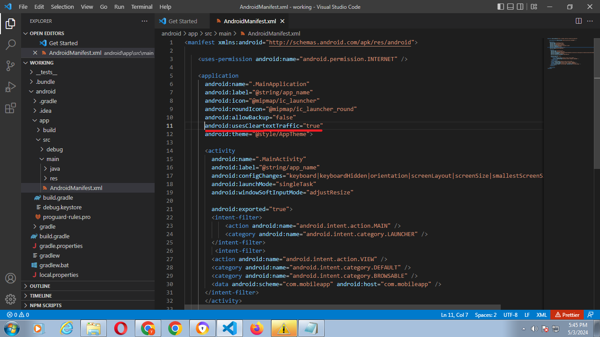
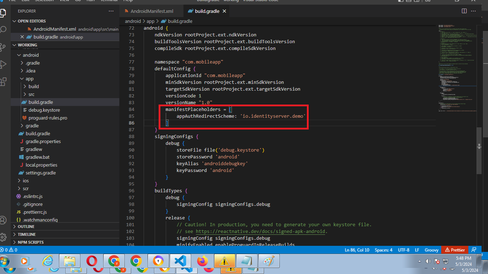
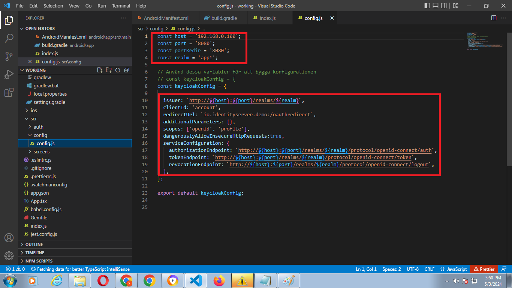
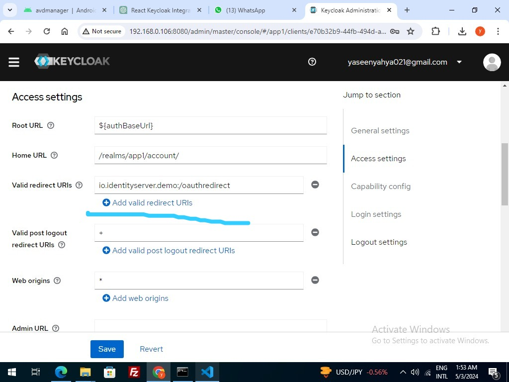
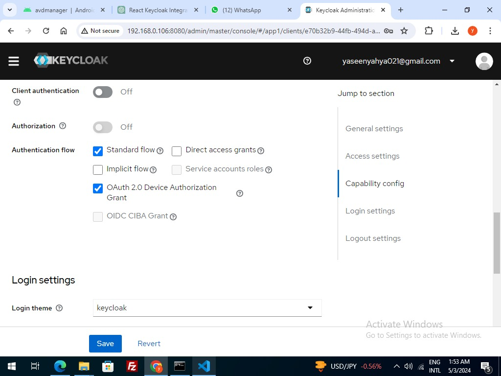

# Keycloak Integration with React Native Example

This repository provides an example of integrating Keycloak authentication with a React Native application. The example demonstrates obtaining login access tokens and refresh tokens from Keycloak for existing users.

## Configuration Steps

### AndroidManifest.xml

In your `AndroidManifest.xml` file, ensure that `android:usesCleartextTraffic="true"` is added. You can refer to the screenshot below for guidance:



### android/app/build.gradle

Add the following configuration in your `android/app/build.gradle` file:

```groovy
manifestPlaceholders = [
    appAuthRedirectScheme: 'io.identityserver.demo'
]
```

You can find an example in the screenshot below:



### Keycloak Settings

1. **Change Issuer Host and Port, Client ID, and Redirect URL:**

   Update the Keycloak settings to match the values provided in the `manifestPlaceholders`. Refer to the screenshot for details:

   

2. **Add Redirect URIs:**

   Configure redirect URIs in Keycloak settings. Refer to the screenshot below for guidance:

   

3. **Additional Authentication Flow Settings:**

   Adjust additional authentication flow settings in Keycloak. Refer to the screenshot below for guidance:

   

## Usage

After configuring the Keycloak settings and integrating them into your React Native application, users should be able to authenticate using Keycloak and obtain access tokens and refresh tokens.
